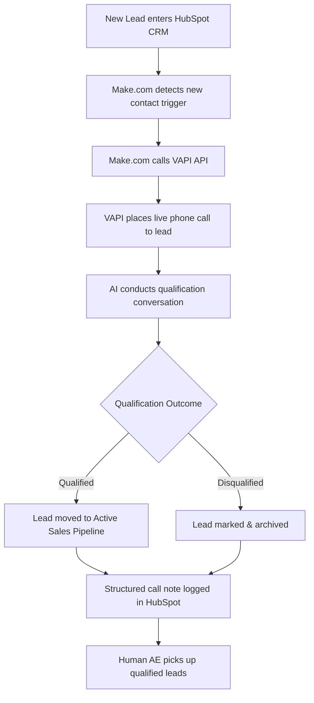

# ai-sdr-caller
AI-powered SDR system that qualifies leads via automated phone calls — built with Make.com, VAPI, and HubSpot
# 🤖 AI SDR Caller

> An AI-powered Sales Development Representative system that automatically qualifies inbound leads via live phone calls — built by a sales professional using no-code and AI tools.

---

## The Problem

Inbound leads go cold fast. Sales teams waste hours manually calling unqualified prospects, and response time directly impacts conversion rates. Most SMBs and scale-ups can't afford to staff a full SDR team just for qualification.

## The Solution

I built an automated qualification system that calls every new lead within minutes of entering the CRM, conducts a live AI-powered conversation, and routes the outcome back into HubSpot — without a human touching it.

---

## System Architecture

---

## Tech Stack

| Tool | Role |
|------|------|
| **HubSpot** | CRM — lead intake, pipeline management, call note logging |
| **Make.com** | Automation layer — detects triggers, orchestrates the workflow |
| **VAPI** | AI voice agent — places and conducts the live qualification call |

---

## How It Works

1. **Lead enters HubSpot** — via form, manual entry, or another integration
2. **Make.com triggers** — detects the new contact and activates the scenario
3. **VAPI call is placed** — the AI dials the lead within minutes
4. **AI qualifies the lead** — conducts a structured conversation using a custom script
5. **Outcome is determined** — qualified or disqualified based on conversation
6. **HubSpot is updated** — a structured note is logged with call summary and status
7. **Qualified leads route** to the active pipeline for human follow-up

---

## Business Outcome

- ⚡ **Response time dropped to minutes** — leads called automatically, no manual trigger needed
- 🎯 **Qualification fully automated** — AEs only speak to leads that passed the AI screen
- 📋 **Zero data entry** — call outcomes and notes logged directly into HubSpot
- 🚀 **Adopted by Waybook** — I pitched this system to the founder and dev team; it is currently being productized and launching as a native Waybook feature

---

## What I Learned

- How to design an end-to-end automation workflow across three separate platforms
- How AI voice agents (VAPI) handle real conversations and where they break down
- The importance of prompt engineering for the qualification script — tone, fallback handling, and edge cases matter enormously
- How to pitch a technical concept as a business outcome to a non-technical founder

---

## What I'd Build Next

- [ ] A/B test qualification scripts to optimize conversion rate
- [ ] Add a SMS/WhatsApp fallback if the call goes unanswered
- [ ] Connect to Slack to notify the AE in real time when a lead qualifies
- [ ] Build a dashboard to track qualification rate, call duration, and pipeline value generated

---

## About

Built by **Diego Cortes** — B2B SaaS sales professional who builds AI-powered tools for revenue teams.

[LinkedIn](https://www.linkedin.com/in/your-linkedin) · [GitHub Profile](https://github.com/diego101019)
