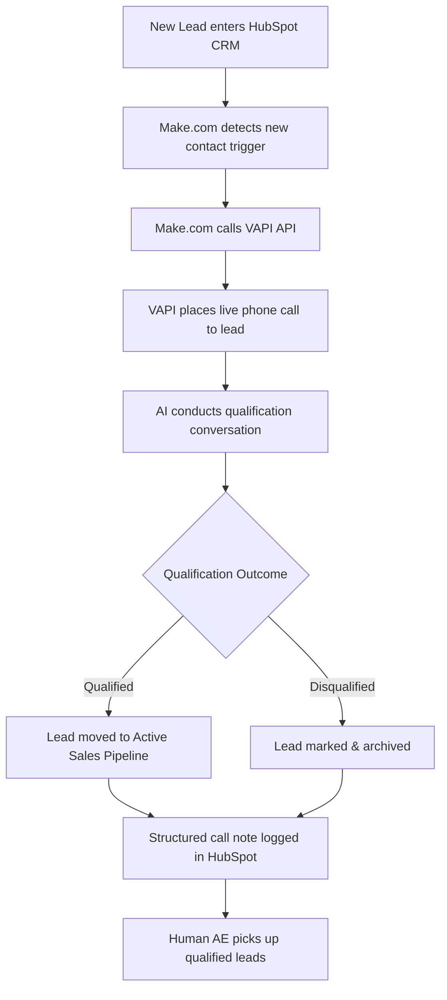

# ai-sdr-caller
AI-powered SDR system that qualifies leads via automated phone calls — built with Make.com, VAPI, and HubSpot
# 🤖 AI SDR Caller

> An AI-powered Sales Development Representative system that automatically qualifies inbound leads via live phone calls — built by a sales professional using no-code and AI tools.

---

## The Problem

Inbound leads go cold fast. Sales teams waste hours manually calling unqualified prospects, and response time directly impacts conversion rates. Most SMBs and scale-ups can't afford to staff a full SDR team just for qualification.

## The Solution

I built an automated qualification system that calls every new lead within minutes of entering the CRM, conducts a live AI-powered conversation, and routes the outcome back into HubSpot — without a human touching it.

---

## System Architecture

---

## Tech Stack

| Tool | Role |
|------|------|
| **HubSpot** | CRM — lead intake, pipeline management, call note logging |
| **Make.com** | Automation layer — detects triggers, orchestrates the workflow |
| **VAPI** | AI voice agent — places and conducts the live qualification call |

---

## How It Works

1. **Lead enters HubSpot** — via form, manual entry, or another integration
2. **Make.com triggers** — detects the new contact and activates the scenario
3. **VAPI call is placed** — the AI dials the lead within minutes
4. **AI qualifies the lead** — conducts a structured conversation using a custom script
5. **Outcome is determined** — qualified or disqualified based on conversation
6. **HubSpot is updated** — a structured note is logged with call summary and status
7. **Qualified leads route** to the active pipeline for human follow-up

---

## Intended Business Outcomes

- ⚡ **Response time dropped to minutes** — leads called automatically, no manual trigger needed
- 🎯 **Qualification fully automated** — AEs only speak to leads that passed the AI screen
- 📋 **Zero data entry** — call outcomes and notes logged directly into HubSpot
- 🚀 **Adopted by Waybook** — I pitched this system to the founder and dev team; it is currently being productized and launching as a native Waybook feature

---

## 📸 Demo & Screenshots

### 🔁 Make.com — Trigger Scenario
> When a new contact is created in HubSpot, Make.com fetches their details and fires an HTTP POST to VAPI to initiate the qualification call. This scenario runs silently in the background the moment a lead enters the CRM.

---

### 📲 Make.com — Post-Call Scenario
> Once VAPI finishes the call, a webhook fires the outcome back into Make.com. A structured note is then automatically written into HubSpot with the call summary and qualification status.

---

### 📞 Sample Qualification Call
> A real AI-conducted qualification call with a test lead.

[019e4797-2d12-7665-ba1d-cab2bdf951b4-1779317648845-37545485-453d-4c0d-90a5-2d0fd017ffcd-mono.wav](https://github.com/user-attachments/files/28083195/019e4797-2d12-7665-ba1d-cab2bdf951b4-1779317648845-37545485-453d-4c0d-90a5-2d0fd017ffcd-mono.wav)

---

### 🗂️ HubSpot — Logged Call Note
> The structured note automatically written back into the CRM after the call completes, including qualification status and conversation summary.

---

### ⚙️ VAPI Configuration
> The AI voice agent setup — model, system prompt, and call handling logic.

---

## What I Learned

- How to design an end-to-end automation workflow across three separate platforms
- How AI voice agents (VAPI) handle real conversations and where they break down
- The importance of prompt engineering for the qualification script — tone, fallback handling, and edge cases matter enormously
- How to pitch a technical concept as a business outcome to a non-technical founder

---

## What I'd Build Next

- [ ] A/B test qualification scripts to optimize conversion rate
- [ ] Add a SMS/WhatsApp fallback if the call goes unanswered
- [ ] Connect to Slack to notify the AE in real time when a lead qualifies
- [ ] Build a dashboard to track qualification rate, call duration, and pipeline value generated

---

## About

Built by **Diego Cortes** — B2B SaaS sales professional who builds AI-powered tools for revenue teams.
