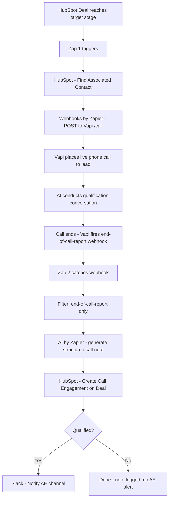

# Zapier AI SDR Caller

AI-powered SDR system that qualifies leads via automated phone calls - built with Zapier, Vapi, and HubSpot

---

## The Problem

Inbound leads go cold fast. Sales teams waste hours manually calling unqualified prospects, and response time directly impacts conversion rates. Most SMBs and scale-ups can't afford to staff a full SDR team just for qualification.

## The Solution

An automated qualification system that triggers an AI phone call the moment a HubSpot deal reaches the right pipeline stage, conducts a live AI-powered conversation, and logs the outcome back into HubSpot - without a human touching it.

This build uses **Zapier** as the orchestration layer, replicating a production Make.com workflow. Built as a hands-on platform evaluation - comparing Zapier and Make.com as orchestration layers for AI sales automation to inform future client recommendations.

---

## System Architecture



---

## Zap Architecture

### Zap 1 - HubSpot Deal Stage → Trigger Vapi Call

| Step | App | Action |
|------|-----|--------|
| Trigger | HubSpot | Updated Deal (polling) |
| Filter | Filter by Zapier | Only continue if `dealstage` = target stage |
| Action 1 | HubSpot | Find Associated Contact |
| Action 2 | Formatter by Zapier | Format phone to E.164 |
| Action 3 | Webhooks by Zapier | POST to Vapi `/call/phone` with email, company, lead source, and deal ID in metadata |

### Zap 2 - Vapi Webhook → HubSpot Call Note + AE Alert

| Step | App | Action |
|------|-----|--------|
| Trigger | Webhooks by Zapier | Catch Hook |
| Filter | Filter by Zapier | Only continue if `message.type` = `end-of-call-report` |
| Action 1 | Code by Zapier | Extract real deal ID from HubSpot compound string |
| Action 2 | AI by Zapier | Generate structured call note from transcript |
| Action 3 | HubSpot | Create Note Engagement on Deal |
| Filter | Filter by Zapier | Only continue if `successEvaluation` = `true` |
| Action 4 | HubSpot | Get Deal (for deal name) |
| Action 5 | Slack | Send qualified lead alert to AE channel |

---

## Tech Stack

| Tool | Role |
|------|------|
| **HubSpot** | CRM - deal stages, contact data, call note logging |
| **Zapier** | Orchestration - detects deal stage changes, chains actions across tools |
| **Vapi** | AI voice agent - places and conducts the live qualification call |
| **AI by Zapier** | Formats raw call transcript into a structured HubSpot note |
| **Slack** | Notifies the AE channel when a lead qualifies |

---

## Key Data Flow

The `hubspot_deal_id` passed as Vapi call metadata is the linchpin - it's how Zap 2 knows which HubSpot deal to update when the call finishes.

```
HubSpot Deal (stage change)
  → deal ID, associated contact ID
    → contact phone number (via HubSpot lookup)
      → Vapi call triggered (deal ID stored in call metadata)
        → call ends, Vapi webhook fires (deal ID in payload)
          → AI-generated call note created on HubSpot deal
            → AE notified in Slack (if qualified)
```

---

## How It Works

1. **Deal stage changes in HubSpot** - manually or via another automation
2. **Zap 1 triggers** - detects the stage change and looks up the associated contact
3. **Vapi call is placed** - the AI dials the lead within minutes, deal ID passed as metadata
4. **AI qualifies the lead** - conducts a structured conversation using a custom Vapi assistant
5. **Call ends, Vapi fires webhook** - `end-of-call-report` sent to Zap 2's catch hook URL
6. **Zap 2 processes the result** - AI by Zapier formats a call note from the transcript
7. **HubSpot is updated** - structured call note logged on the deal with outcome and summary
8. **AE is alerted in Slack** - only if the lead passed qualification

---

## Screenshots

### Vapi - AI Voice Agent Configuration
> The AI voice agent setup - model, system prompt, and call handling logic.


---

### HubSpot - Logged Call Note
> The structured note automatically written back into the CRM after the call completes, including qualification status and conversation summary.


---

### Sample Qualification Call
> A real AI-conducted qualification call with a test lead.

[019e4797-2d12-7665-ba1d-cab2bdf951b4-1779317648845-37545485-453d-4c0d-90a5-2d0fd017ffcd-mono.wav](https://github.com/user-attachments/files/28083195/019e4797-2d12-7665-ba1d-cab2bdf951b4-1779317648845-37545485-453d-4c0d-90a5-2d0fd017ffcd-mono.wav)

---

## Insights

- Where Zapier and Make.com differ in practice for this type of workflow: polling vs. instant triggers, field mapping UX, and task consumption model - hands-on findings from running both platforms in parallel
- Zapier's HubSpot deal trigger requires an extra association lookup step - the deal object doesn't include contact data natively
- Vapi sends multiple event types to a single webhook URL - filtering for `end-of-call-report` in Zapier is essential or you get spurious Zap runs
- The `metadata` field on a Vapi call is the cleanest way to carry CRM context through a voice call and back into your automation
- AI by Zapier can replace a Formatter step for unstructured-to-structured transformation, reducing prompt engineering overhead


---

## About

Built by **Diego Cortes** - B2B SaaS sales professional and AI automation consultant. I build automated revenue workflows for SMB sales teams.
